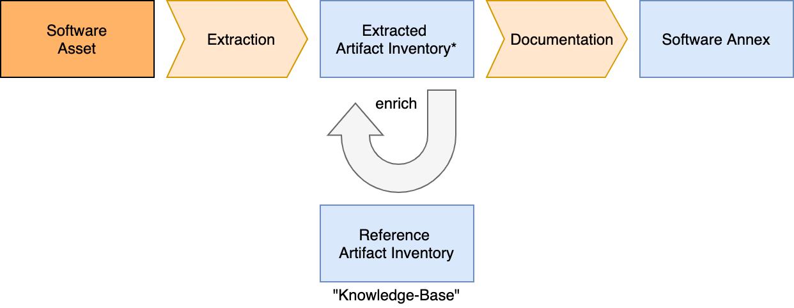

# Artifact Inventory Spreadsheet

The spreadsheet representation of the Artifact Inventory addresses several target audiences.
For small- to mid-sized projects in particular, it represents a very convenient and direct approach
to review and assess the metadata of artifacts.

Artifact Inventory Spreadsheets can be used 
* as representation of knowledge on known software artifacts (Reference Artifact Inventory), or
* as inventory of identified items in the extraction process (Extracted Artifact Inventory).

The following picture covers the two Artifact Inventory applications:

A Reference Artifact Inventory is usually defined by a dedicated Maven project. The Reference Artifact Inventory 
contains all information known about the used software artifacts; it constitutes a "Knowledge-Base". 

A Extracted Artifact Inventory is the result of an extraction process. It is usually organized in an extractor
Maven project specific to a software asset. The resulting Artifact Inventory Spreadsheet contains only those artifacts 
which are have been found in the Software Asset that is being extracted. 

An Extracted Artifact Inventor can be enriched with information from the Reference Artifact Inventory. This is - as 
depicted - done before running the documentation process to produce the Software Annex.

## Worksheets

The artifact inventory spreadsheet uses several worksheets:
* **Artifact Inventory**: The Artifact Inventory spreadsheet lists all artifacts with
  their individual metadata.  
  See [Artifact Inventory Worksheet](artifact-inventory-worksheet.md) for details.
* **License Notices**: The License Notices spreadsheet contains license notices that 
  explain additional license related backgrounds, determine the effective licenses and
  support fulfillment of license obligations (as far as these can be addressed in 
  documentation). 
  See [License Notices Worksheet](license-notices-worksheet.md) for details.
* **Component Patterns**: Artifact may consist of several files. Component patterns
  specify patterns to identify the individual files, such that an extractor can identify
  the artifacts on coarse-grained level. 
  See [Component Patterns Worksheet](component-patterns-worksheet.md) for details.
* **Vulnerabilities**: This spreadsheet aggregates vulnerability information for the 
  artifacts in the Artifact Inventory spreadsheet.
* **Licenses**: This spreadsheet contains license metadata, such as identifiers and 
  license characteristics. 
  See [Licenses Worksheet](licenses-worksheet.md) for details.
  
Please note that an Artifact Inventory is self-contained. It does not require any other
data source to convey the complete metadata of an asset and the covered artifacts.

The Inventory Spreadsheet is integrated in a dedicated folder structure:
* **inventory**: contains one or more inventory spreadsheets
* **licenses**: contains all license texts in dedicated sub-folders
* **components**: container additional component-centric license variants and notices

The Inventory Spreadsheet in combination with licenses and component-specific files is
a multi-purpose knowledge base: 
1) It controls the extraction process using specific artifact metadata and component patterns.
2) It enriches the identified files for verification and documentation
3) It serves as baseline for vulnerability correlation and assessments

The following use cases have been identified to support modifications of the Artifact 
Inventory with documentation:
* [Adding a new Artifact Version](use-case-add-new-artifact-version.md)
* [Adding a new Artifact](use-case-add-new-artifact.md)
* [Adding a new License](use-case-add-new-license.md)